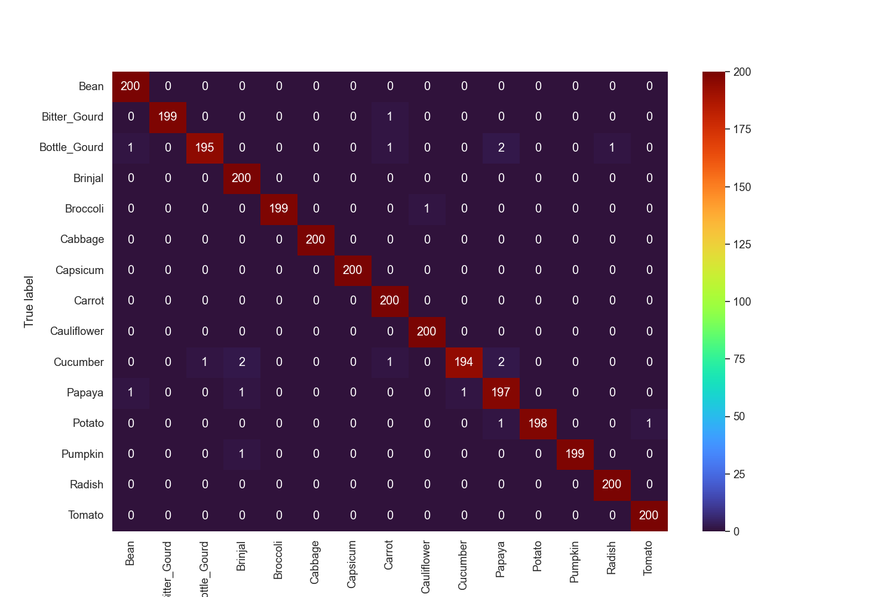
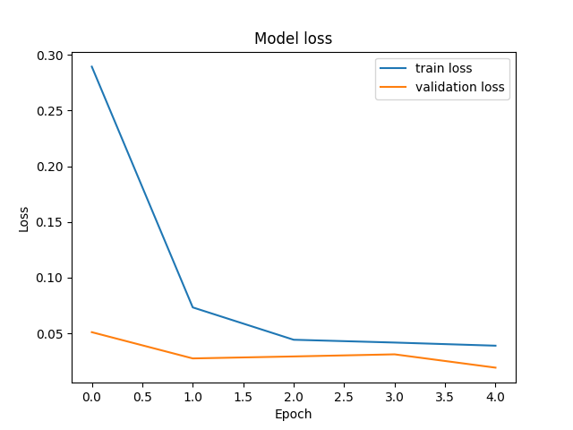
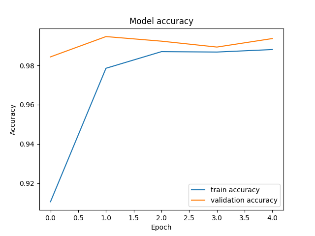

# Predicting Types of vegetables based on Images

## Abstract

There is a significant demand to eat healthier but many people don't have the background in types of produce to ensure they are always using the correct ingredients. With this project, we aim to create a tool that can identify what a given vegtable is usingmachine learning techniques.

## Introduction

As people who would like to eat an adequate amount of vegetables, and as avid farmer's market enjoyers, we often found ourselves overwhelmed with the many different types of vegetables out there. 
Using an image dataset found on kaggle.com with 15 different types of vegetables, this is a well-suited situation for a convolutional neural network.
That being said, we had not used a dataset quite this large in class and had various concerns about whether a standard laptop would be able to handle the amount of processing power needed to train the model.
Initially, PyTorch was the most obvious library to use as we had the ost familiarity, though we initially had plans to try different libraries that were not deemed necessary as any method that attempts to train the model from scratch is likely to need the same significant amount of work.
The main limitations associated with training a model from scratch are the amount of processing power needed and we initially tried using a discovery cluster before moving on to a pre-trained model.

## Setup

a) The dataset used was conveniently already split up into a train, test, and validation set, with a folder for each vegetable - a total of 15. Each folder in the training set contained 1000 images, each folder in the test and validation sets contained 200 images. The folders are filled of each vegetable either alone or multiple with different backgrounds.

b) We ran and created our models on our local computers. We used the TensorFlow library mainly to learn a new way of building models and because our previous effort at starting a convultional model from scratch using PyTorch was long and fustrating after some time. Our best model consisted of using tranfer learning from the Inception version 3 model. The InceptionV3 model is a deep learning model that has been trained on a large dataset of images called ImageNet, which contains over 14 million images across more than 20,000 classes. The model is known for its ability to classify images with high accuracy while minimizing the number of parameters required, and was choosen because it can identify certain features of the vegetables that may be common across different types and use them to make more accurate classifications and may have been trained on some images of vegetables as well. Since this model was already very accurate and large we did not wish to retrain this model but rather use this model's output and add on more convonlutional layers instead. As for parameters we just put in the imahges since the  inception model is built to be able to process phhotts efficently already. 

c) As mentioned in part b, we used transfer learning to add 15 convonlutional layers onto the already trained Inception Model, and did not retrain the model to keep it's accuracy and save time. Our new model takes in the output of the inception model and uses that as an input through 15 nodes. Each node consists of using the GlobalAveragePooling2D to take the matrix average of the featuremap fro

## Results

We found much greater success in the tensorflow model than the PyTorch model, and were able to create a very accurate model using transfer learning.
This success can be seen in the following visuals:

Exhibit 1: Confusion matrix where higher numbers on the diagonal indicate correctly predicted images.

Exhibit 2

Exhibit 3

## Discussion

## Conclusion

## References

Dataset citation: https://www.researchgate.net/publication/352846889_DCNN-Based_Vegetable_Image_Classification_Using_Transfer_Learning_A_Comparative_Study

[Kaggle link](https://www.kaggle.com/datasets/misrakahmed/vegetable-image-dataset?resource=download)

