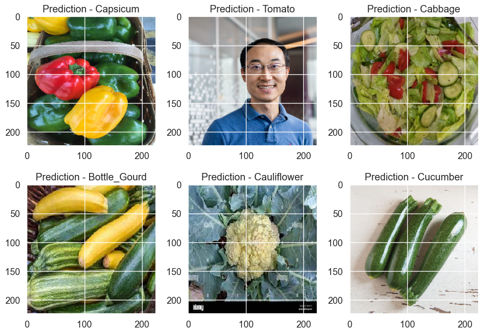

# Predicting Types of vegetables based on Images

## Abstract

There is a significant demand to eat healthier but many people don't have the background in types of produce to ensure they are always using the correct ingredients. With this project, we aim to create a tool that can identify what a given vegtable is usingmachine learning techniques.

## Introduction

As people who would like to eat an adequate amount of vegetables, and as avid farmer's market enjoyers, we often found ourselves overwhelmed with the many different types of vegetables out there. 
Using an image dataset found on kaggle.com with 15 different types of vegetables, this is a well-suited situation for a convolutional neural network.
That being said, we had not used a dataset quite this large in class and had various concerns about whether a standard laptop would be able to handle the amount of processing power needed to train the model.
Initially, PyTorch was the most obvious library to use as we had the ost familiarity, though we initially had plans to try different libraries that were not deemed necessary as any method that attempts to train the model from scratch is likely to need the same significant amount of work.
The main limitations associated with training a model from scratch are the amount of processing power needed and we initially tried using a discovery cluster before moving on to a pre-trained model.

## Setup

a) The dataset used was conveniently already split up into a train, test, and validation set, with a folder for each vegetable - a total of 15. Each folder in the training set contained 1000 images, each folder in the test and validation sets contained 200 images. The folders are filled of each vegetable either alone or multiple with different backgrounds.

b) We ran and created our models on our local computers. We used the TensorFlow library mainly to learn a new way of building models and because our previous effort at starting a convultional model from scratch using PyTorch was long and fustrating after some time. Our best model consisted of using tranfer learning from the Inception version 3 model. The InceptionV3 model is a deep learning model that has been trained on a large dataset of images called ImageNet, which contains over 14 million images across more than 20,000 classes. The model is known for its ability to classify images with high accuracy while minimizing the number of parameters required, and was choosen because it can identify certain features of the vegetables that may be common across different types and use them to make more accurate classifications and may have been trained on some images of vegetables as well. Since this model was already very accurate and large we did not wish to retrain this model but rather use this model's output and add on more convonlutional layers instead. As for parameters we just put in the imahges since the  inception model is built to be able to process phhotts efficently already. 

c) As mentioned in part b, we used transfer learning to add 15 convonlutional layers onto the already trained Inception Model, and did not retrain the model to keep it's accuracy and save time. Our new model takes in the output of the inception model and uses that as an input through 15 nodes. First the model takes the matrix average of the feature map from the output using GlobalAveragePooling2D. This is how our add on model will use the inception model in the next steps. Then it goes through a fully connected convolutional layer with 128 neurons and a ReLU activation function. This layer helps tailor the inception model to our dataset. Then there is a Dropout layer with a rate of 0.2 to avoid overfitting. Lastly, it goes through a fully connected convolutional with 15 nodes to predict each vegetable with softmax activation. This layer produces a probability distribution over 15 classes, which represents the model's prediction for the input image. The softmax activation function ensures that the output values sum to 1 and that each value represents the probability of the input image belonging to a particular class.

## Results

We found much greater success in the tensorflow model than the PyTorch model, and were able to create a very accurate model using transfer learning.
This success can be seen in the following visuals:

Exhibit 1: Confusion matrix where higher numbers on the diagonal indicate correctly predicted images.

Exhibit 2: The loss of the tensor flow model as more epochs were added

Exhibit 3: The accuracy of the tensor flow model as more epochs were added

Further, after seeing the success in the dataset images, we tested our model on other images of (mostly) vegetables, some of which are found in the training data and some of which are not.
In order, the pictures seen are of bell peppers (Capsicum), professor Zhang, a garden salad, squash, an underripe cauliflower, and zucchini.
These predictions were very accurate for the vegetables that were in the dataset, and it is interesting to see that it predicted zucchini as cucumber as that is what we would have predicted as well.

Exhibit 4: our images and what they were predicted as using the TensorFlow model

## Discussion

Based on the results shown above our, model performed impeccably. After the second epoch our model performed with over 95% accuracy. We found that our model had the most accurate results around the 5th epoch (the graph is misindexed) and so that's the epoch we have kept. One great thing that we have found about this model is that is has avoided overfitting. We found that the validation accuracy was greater than the testing accuracy which tells us that we have reduced overfitting. We also have found that our model has performed with a low loss valuesafter the second epoch as well which is great news. 

Looking at the confusion matrix, we were pleased to find that over half of the vegatables were predicted with 100% accuracy. While our model was pretty accurate it mixed up the Papaya, Bottle Gourd, and Cucumber the most, proably because of their similar cylinder shapes. 

Since we have found some accurate results we looked up other models that have either used the same or similar datasets. One medium article decribes how it used CNN models to reach a 95% accuracy score, which is worse than ours :). This article can be found in our references title: "Medium Article Link". This article goes through the model step by step using the Keras library and builds a model from scratch. It uses two 2D convonlutional layers and 2 MaxPooling for results. They also choose to use ReLu activation for their model for each convolutional layer. The the model then flattens the output of these convolutional layers to flatten the 3 Dimensional feature volume. Then adds 2 dense fully connected layers using ReLU activation and a dropout function between the layers to avoid overfitting. Lastly using the softmax activation to obtain the final veggie classifications.

## Conclusion

One of the main run ins we had with this project was developing a CNN model from scratch in PyTorch. While, we had a good understanding of the model we thought it would be more effective to add a bunch of different convonlutional layers for greater accuracy. This lead to later fustration with the run time of our model and once we got it going we found accurate results of over 98% in our transfer learning model and decided to move on. Reading the Medium article referenced above was really interesting because we found that they used a lot less nodes than we did but instead trained the model with about 100 epochs instead. Moving forward we will consider this misunderstandingand look for the most efficent balence between number of layers and number of epochs.  

## References and Sources

Dataset citation: 

[Official Reference link](https://www.researchgate.net/publication/352846889_DCNN-Based_Vegetable_Image_Classification_Using_Transfer_Learning_A_Comparative_Study)

[Kaggle dataset link](https://www.kaggle.com/datasets/misrakahmed/vegetable-image-dataset?resource=download)

[TensorFlow documentation](https://www.tensorflow.org/tutorials/keras/save_and_load)

[Medium Article link](https://medium.com/mlearning-ai/vegetable-image-classification-using-cnn-6f1d1be75cfb)

[Helpful learning](https://www.kaggle.com/datasets/misrakahmed/vegetable-image-dataset?resource=download)

